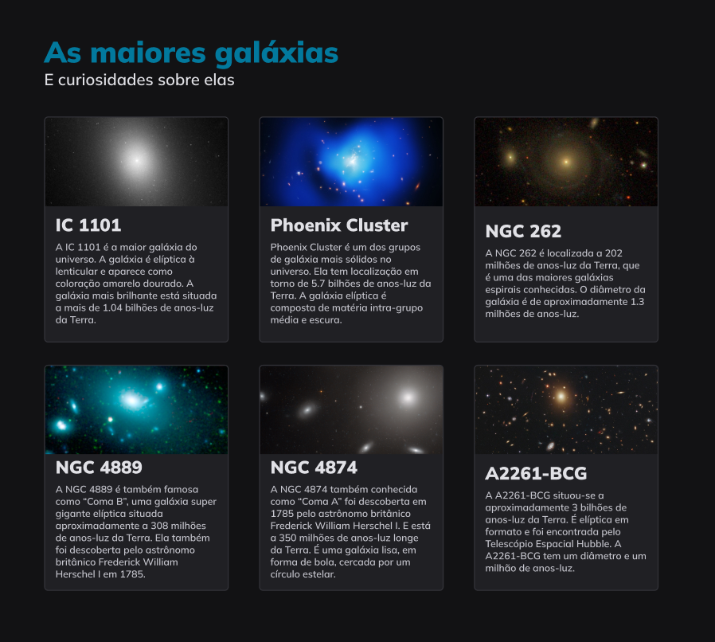

  

## 🖥️ Projeto

O projeto é um estudo de Grids. 

## 🚀 Tecnologia

Esse projeto foi desenvolvido com as seguintes tecnologias:

- HTML
- CSS
- GIT e GITHUB

## 🏷️ Layout

Você pode visuzalizar o layout do projeto através 
[Desse link](https://www.figma.com/design/IXHDqhv3WhTtEbRhWV3e0M/Galaxies-%E2%80%A2-Projeto-Explorer-(Community)).

É necessário ter uma conta no [Figma](https://www.figma.com)